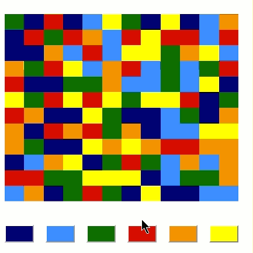

# pyFlood

This is a Python implementation of the color flood game. 

The aim of the game is to fill (flood) the entire board with a single color in the 
minimum number of steps. In each step, the player selects a color from 6 colors to 
flood the board. The player iterates until all the cells in the board 
have a single color. 

The flooding function implements the *stack-based recursive (four-way)* algorithm  described 
[here](http://en.wikipedia.org/wiki/Flood_fill).

# Project Setup

### Dependencies 
- Plotly Dash
- numpy

### Project Structure

#### Game Files

- `frontend.py`: Game front-end. Renders the game GUI in a browser using Dash. 
The `play()` function holds the main game logic.
- `backend.py`: Game back-end. Holds game logic.
- `frontend_helper.py`: Includes helper functions for the front-end.
- `colors.py`: Includes a set of variables for color definition.
- `settings.py`: Includes game settings (e.g. grid size).

#### Meta Files:
- `README.md`: This file. It contains information about the project.
- `LICENSE.txt`: GNU GPL v3.0 License file.
- `Demo/`: Includes a video demo and an animated GIF for demo and documentation purposes.

#### Side Code
- `Exploration/`: Miscellaneous scripts I found useful while developing the program.

### To Run the Program

1. Run the `frontend.py` script: `C:\ProgramData\Anaconda3\python.exe frontend.py`
2. Once the Python prompt returns with `Running on http://127.0.0.1:8050/`, open the returned URL in the browser and start playing.

# To Do

- Implement a dummy automatic player (i.e. random color select).
- Implement an automatic player using reinforcement learning.
- Implement an API for others to plug-in their automatic player.
- Deploy the app (Dockers?) 

# Contributors

- Ahmad Al-Kashef: Initial implementation (v1.0).

# License

This is an open source free program provided under Version 3 of the GNU GENERAL PUBLIC LICENSE. 
A copy of the license is available in LICENSE.txt at the root of the source code. 
If not, please see <http://www.gnu.org/licenses/>.
